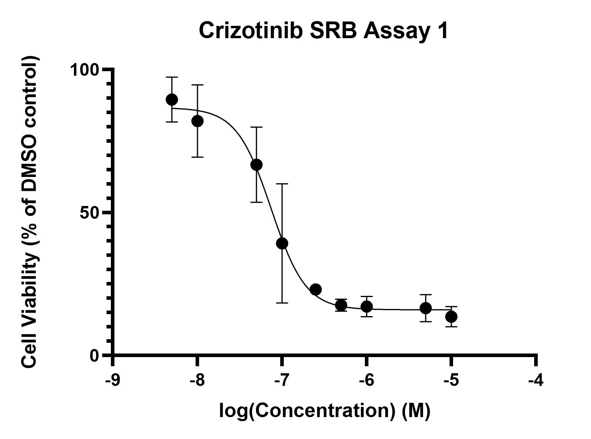

# Lab Book 8/7/19
- **Author:** Priyal Dass
- **Supervisor:** Associate Professor John Ashton
------------------------------------------------------------------
## Overview

Continuing final crizotinib SRB replicates and getting into selumetinib replicates + cell line maintenance
------------------------------------------------------------------
## Tasks
1. Crizotinib assay 3 Day 5 final steps + data analysis
2. Crizotinib assay 4/Selumetenib assay 1 Day 5
3. Selumetenib assay 2 Day 1
4. Cell maintenance
------------------------------------------------------------------
## Task 1: Crizotinib assay 3 Day 5 final steps + data analysis

The [protocol](../Protocols/SRB_Cytotoxicity_assay.md) was paused at the final drying step on [5/7/19](../Daily_lab_book/LB_19-07-05.md). Today I added the Tris-HCl and measured the aborbance. The data was added to the Crizotinib only .pzfx file and the following graph was produced (including replicate 1): 

Crizotinib IC50 =7.451e-008M

### Next
Get the data for the final crizotinib replicate (#4) and make a new curve with replicates #2, #3, and #4.

------------------------------------------------------------------
## Task 2: Crizotinib assay 4/Selumetenib assay 1 Day 5

[Day 5 of the SRB protocol](../Protcols/SRB_Cytotoxicity_assay.md) was carried out upto the acetic acid wash and dry step. The plate will be stored at room temperature until tomorrow (9/5/19) when the assay will be continued.

### Next
Finishing assay + data analysis - see above for crizotinib plans

------------------------------------------------------------------
## Task 3: Selumetenib assay 2 Day 1 + cell splitting

The flask split on [1/7/19](../Daily_lab_book/LB_19-07-01.md) was split today and the resuspended cells were used to seed a 96 well plate at 7000 cells per well and incubated at 2pm. From the remaining resuspended cells a new flask was made at a 1:20 dilution - still tyring to find the right dilution to have cells ready to split after 7 days.

### Next
Treat the plated cells with selumetinib at 2pm tomorrow 9/7/19  
Media change on Wednesday 10/7/19

------------------------------------------------------------------
## Task 2: Cell maintenance

The media of the H3122 P8 cells split on [4/7/19](../Daily_lab_book/LB_19-07-01.md) was changed.

### Next
Media change on Wednesday 10/7/19 and split for selumetinib assay 3 on Friday 12/7/19
