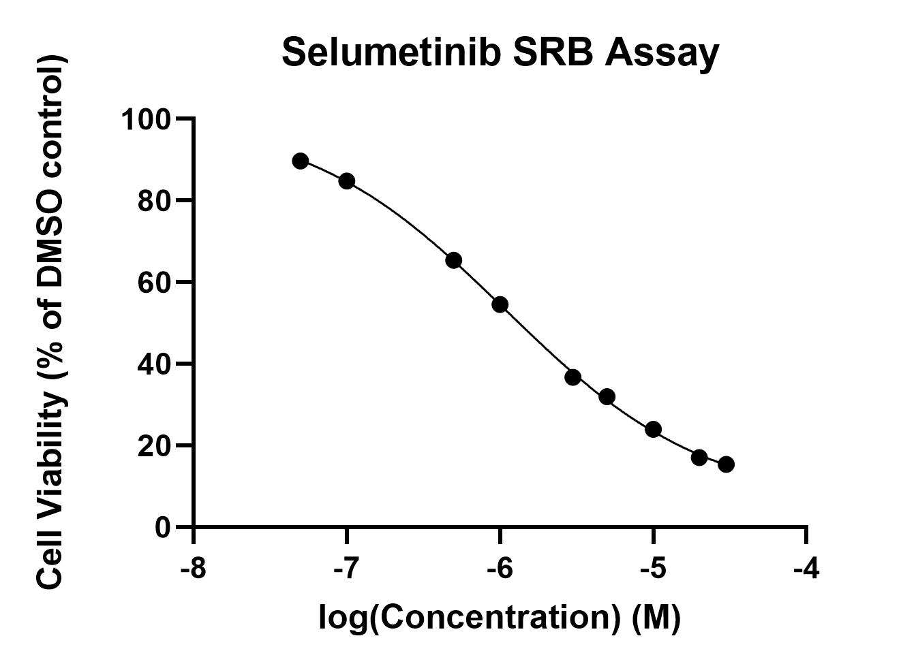

# Lab Book 10/7/19
- **Author:** Priyal Dass
- **Supervisor:** Associate Professor John Ashton
------------------------------------------------------------------
## Overview

Cell maintenence + data analysis

------------------------------------------------------------------
## Tasks

1. Changing media
2. Data analysis for crizotinib assay 4/selumetinib assay 1
------------------------------------------------------------------
## Task 1: Media change

Changing media for H3122 P9 cells (2x flasks)  
[Protocol](../Protocols/Media_change.md)

-------------------------------------------------------------------
## Task 2: Data analysis for crizotinib assay 4/selumetinib assay 1

The protocol was paused on [10/7/19](../Daily_lab_book/LB_19-07-08.md) at the final drying step. Today the Tris-HCl was added and the absorbance was measured. For each drug the outside wells were excluded because they had evaporated slightly.

The crizotinib results for assay 4 were added to the Crizotinib only .pzfx and a new Prism file was made for the selumetinib results.

#### Crizotinib results (all 4 replicates)
IC50 = 8.396e-008M

#### Crizotinib results (replicates 2, 3 and 4 only)
IC50 = 1.018e-007M

#### Selumetinib results (replicate 1)
IC50 = 1.083e-006M

### Next:
Continue with selumetinib SRB replicates
