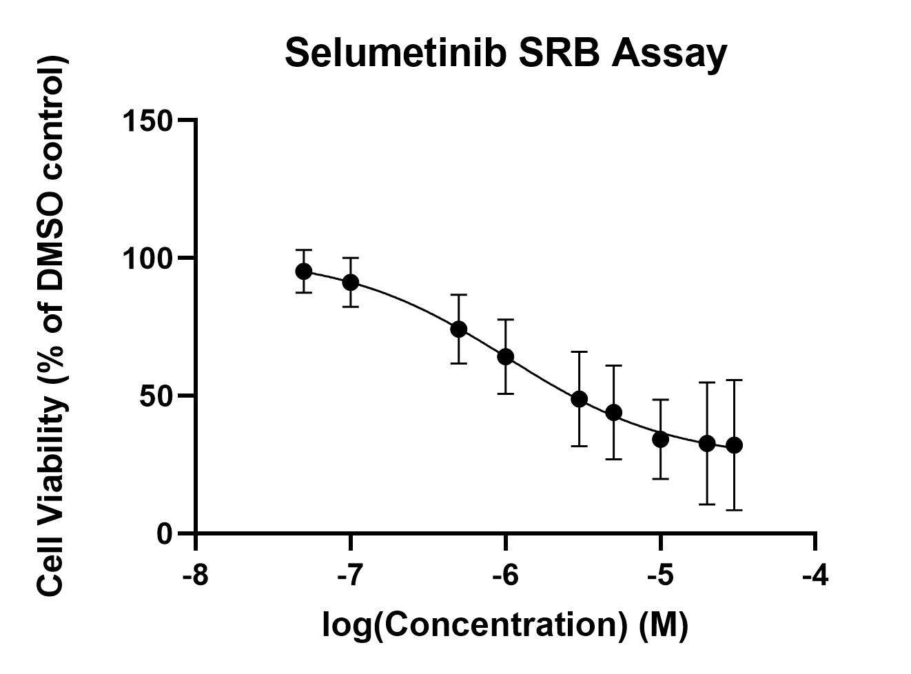

# Lab Book 15/7/19
- **Author:** Priyal Dass
- **Supervisor:** Associate Professor John Ashton
------------------------------------------------------------------
## Overview

Continuing with selumetinib replicates 2 and 3 + starting on first selumetinib/crizotinib replicate
------------------------------------------------------------------
## Tasks

1. Selumetinib replicate 2 reading + data analysis
2. Selumetinib replicate 3 day 5
3. Selumetinib replicate 4  day 1
4. Cell maintenence

[Protocol for SRB](../Protocols/SRB_Cytotoxicity_assay.md)

------------------------------------------------------------------
## Task 1: Selumetinib replicate 2 reading + data analysis

The 96 well plate was stained with SRB on [12/7/19](../Daily_lab_book/LB_19-07-15.md) and stored at room temperature over the weekend. Today Tris-HCl was added and the absorbance was measured. The data was added to the existing Selumetinib_only.pzfx file and the following graph was produced:

### Next
Start calculating the concentrations for the C/S combination SRB assay (will update when have all 3 IC50s for selumetinib) + continue with replicates

------------------------------------------------------------------
## Task 2: Selumetinib replicate 3 day 5

SRB protocol was carried out until the acetic acid wash and dry step. Plate will be left at room temperature overnight.

### Next
Measure absorbance and data analysis tomorrow.

------------------------------------------------------------------
## Task 3: Selumetinib replicate 4 day 1

Originally was planning to do first crizotinib/selumetinib combination assay today but 2 selumetinib replicates are quite different from each other so need to do at least one more selumetinib replicate (on top of replicate #3) before moving onto combination assays. Using the 1:10 P9 flask split on [11/7/19](../Daily_lab_book/LB_19-07-11.md) a 96 well was plated today with 7000 cells/well as per day 1 of the SRB protocol. The plate was incubated at 2:45pm.

### Next
Drug treat cells with selumetinib at 2:45pm tomorrow 16/7/19

------------------------------------------------------------------
## Task 4: Cell maintenence
From the resuspended cells used to set up selumetinib replicate 4 day 1 a new flask was split (1:30 dilution, P10). This flask will be split in a week on Monday 22/7/19.
The media for the 1:30 P9 flask (also split on 11/7/19) was also changed.

### Next
Media change both flasks on Wednesday 17/7/19
