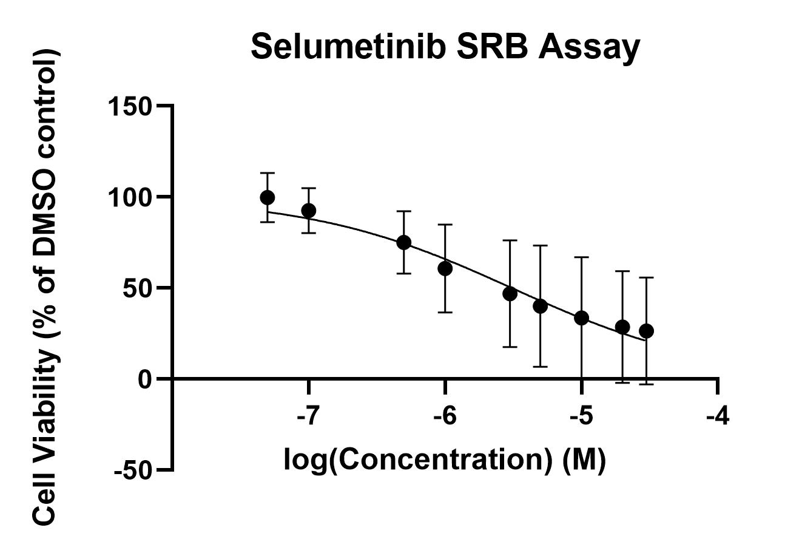

# Lab Book 24/7/19
- **Author:** Priyal Dass
- **Supervisor:** Associate Professor John Ashton
------------------------------------------------------------------
## Overview

Organising data + analysing 2 SRB replicates
Also growing CR-H3122
------------------------------------------------------------------
## Tasks: Data reorganisation

1. Data reorganisation
2. Crizotinib 5/selumetinib 5 SRB stain and reading
3. Selumetinib assay 4 and crizotinib 5/selumetinib 5 data analysis
4. Cell maintenance
5. Reviving CR-H3122

------------------------------------------------------------------
## Task 1: Data reorganisation

All of the individual excel files with the raw data for each SRB replicate have been consolidated into one .xls per drug and each replicate in a separate sheet within that. The old individual files have been moved to a local file and new files are [here](../Raw_SRB_data)

------------------------------------------------------------------
## Task 2: Crizotinib 5/selumetinib 5 SRB stain, reading and data analysis

The [protocol](../Protocols/SRB_Cytotoxicity_assays.md) was paused at the first dry step on [22/7/19](../Daily_lab_book/LB_19-07-22.md). Today the protocol was continued. After doing the data analysis in excel, there is no trend of decreasing growth with increasing drug concentrations for both drugs. As well as this the SRB stain itself was very pale compared with usual. There seems to be a problem at the seeding step after than a drug related problem because previously crizotinib has not been problematic. These replicates were not be added to the prism file.

### Next
???

------------------------------------------------------------------
## Task 3: Selumetinib assay 4 and crizotinib 5/selumetinib 5 data analysis

The data from [22/7/19](../Daily_lab_book/LB_19-07-22.md) was analysed today for selumetinib replicate 4. After adding it to prism it looks like replicate 3 and 4 are similiar to each other - will need to do one more selumetinib replicate to get a set of 3 - but need to sort seeding issue first.

Updated graph with all 4 replicates (but will likely exclude 1 and 2 in final graph):  
IC50 = 3.096e-006

### Next
Try again to get a complete set of selumetinib replicates
