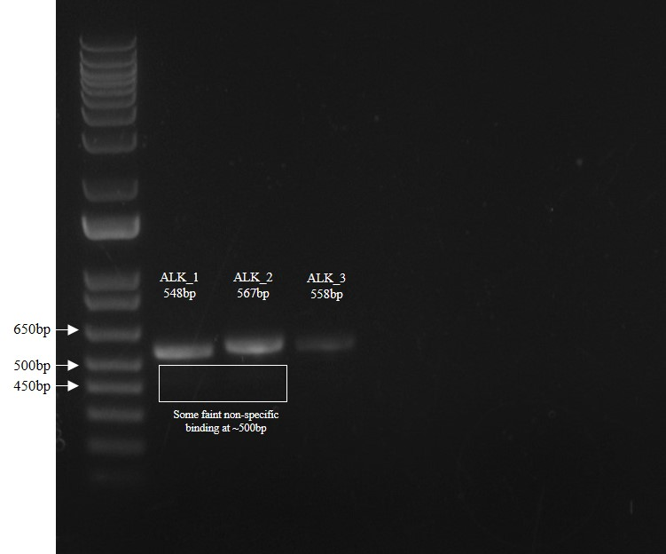

# Lab Book 16/8/19
- **Author:** Priyal Dass
- **Supervisor:** Associate Professor John Ashton
------------------------------------------------------------------
## Overview

PCR using 3x ALK primers on the H3122 cDNA and running gel

------------------------------------------------------------------
## Tasks

1. H3122 cDNA PCR with 3x primer primer pairs
2. Running PCR products on gel to visualise results
3. Selumetinib SRB 8 day 5

------------------------------------------------------------------
## Task 1: H3122 cDNA PCR with 3x primer primer pairs

4 PCR reactions were set up according to the [Expand polymerase protocol](../Protocols/Expand_polymerase_PCR.md) with the [H3122 cDNA](../Daily_lab_book/LB_19_08_14.md)

- Reaction 1: ALK_1 Primers
- Reaction 2: ALK_2 Primers
- Reaction 3: ALK_3 Primers
- Reaction 4: No template control with ALK_1 primers

As this was the first time these primers were used, a few things needed to be done before setting up the PCR.
- The 6 primers were suspended in 250uL of filter sterilised water to make a 100mM stock.
- From these stocks, 10uM working stocks were made for each primer
- The cDNA was diluted 1:5 to give an approximate concentration of 5ng/uL

Doing a gradient PCR for all 3 primer sets would use up almost all the cDNA so instead a normal PCR was done using an annealing temperature of 59°C for all reactions. Extension time was 45seconds for ~550bp product.

### Next
Run gel (below)

------------------------------------------------------------------
## Task 2: Running PCR products on gel to visualise results

The PCR products were run on a 1% agarose gel (made in TAE buffer and 2.5uL/100mL EtBr) for 45 minutes at 85V. The gel was then imaged:

All primer pairs have given bands which match their expected sizes and the no template control gave no band.

Primer pairs ALK_1 and ALK_2 both had faint bands about 50bp below the target bands, indicating some off target binding (probably could be resolved with a higher annealing temp). Sequencing the PCR products directly could lead to messy sequence because of the extra bands.

PCR products were stored at 4°C over the weekend before further work.

### Next
Gel purify PCR products and send for sequencing

------------------------------------------------------------------
## Task 3: Selumetinib SRB 8 day 5

Day 5 of the SRB protocol was carried out upto the final dry step

### Next
Add the Tris-HCl and measure the absorbance on Monday 19/8/19
