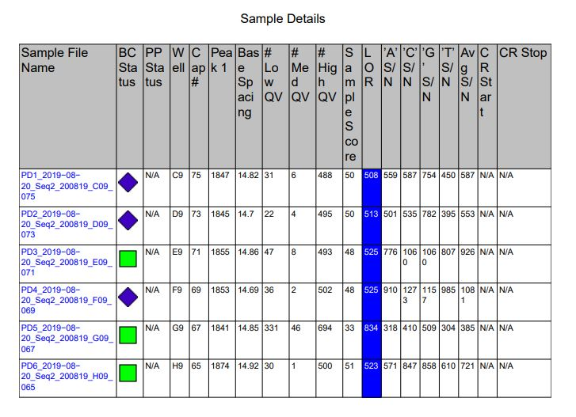
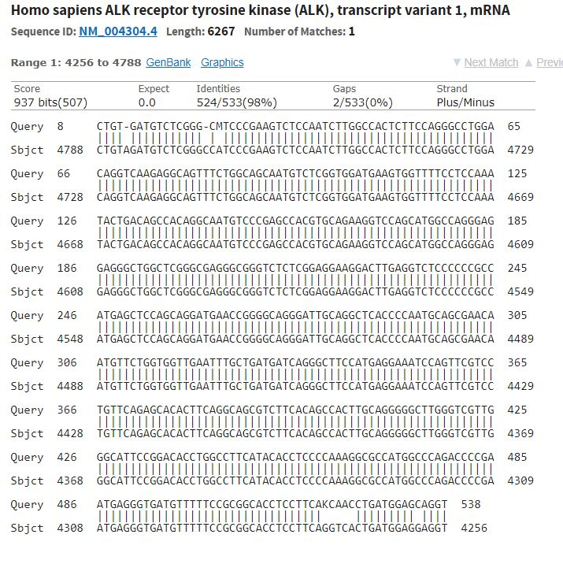

# Lab Book 20/8/19
- **Author:** Priyal Dass
- **Supervisor:** Associate Professor John Ashton
------------------------------------------------------------------
## Overview

Getting first set of sequencing data

------------------------------------------------------------------
## Tasks

1. Cell maintenance
2. H3122 sequencing results

------------------------------------------------------------------
## Task 1: Cell maintenance

Media was changed for the CR-H3122 P4 flask aand the H3122 P14 flask [split on 15/8/19](../Daily_lab_book/LB_19-08-15.md). The other H3122 P14 flask was discarded.

### Next
Set up SRB plate on Thursday 22/8/19

------------------------------------------------------------------
## Task 2: H3122 sequencing results

Overall quality is acceptable - ALK_3 gave the best sequence trace (the PCR product which didn't show any extra bands). The sequencing reaction worked which is good, will use 4uL of gel purified product in future.

All sequences match to the ALK kinase domain and don't show any polymorphisms compared to the human reference.
Any mismatches correspond to dodgy trace quality at the start and end of the sequence.

### Next
Repeat process with CR-H3122 cells
