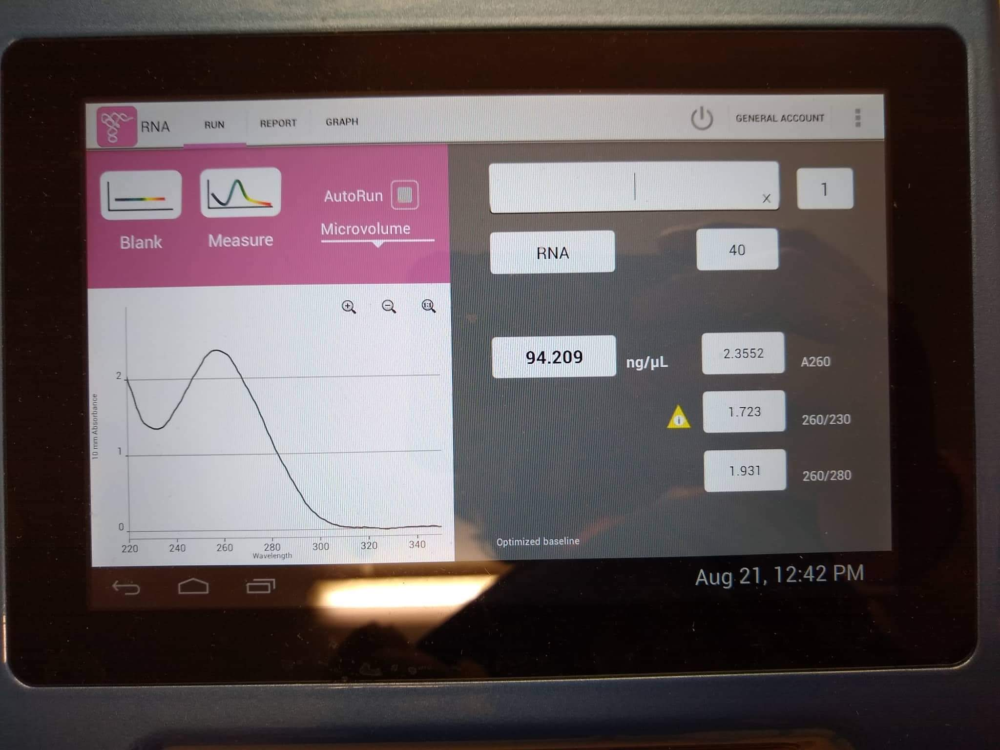

# Lab Book 21/8/19
- **Author:** Priyal Dass
- **Supervisor:** Associate Professor John Ashton
------------------------------------------------------------------
## Overview

Preparing cDNA from non clonally purified CRH3122 cells
------------------------------------------------------------------
## Tasks

1. Spitting CRH3122 cells
2. CRH3122 RNA extraction
3. CRH3122 cDNA synthesis

------------------------------------------------------------------
## Task 1: Spitting CRH3122 cells

The CRH3122 P4 cells were split. From the trypsinised cells 10^6 cells were counted and put in an eppendoft tube for RNA extraction. The remaining cells were then split 1:10 into a new flask.

### Next
Continue media changing flask

------------------------------------------------------------------
## Task 2: CRH3122 RNA extraction

RNA was extracted from the 10^6 CR H3122 cells following the [same protocol as last time](../Protocols/RNA_extraction.md)

RNA quantity was less than last time but the overall quality was acecptable.

### Next
Proceed with cDNA synthesis
------------------------------------------------------------------
## Task 3: CRH3122 cDNA synthesis

cDNA was synthesised from the RNA extracted in Task 2 using the [same protocol as last time.](../Protocols/cDNA_synthesis.md) cDNA is stored at -20C with the H3122 cDNA.

### Next
Carry out PCR on the CRH3122 cDNA
