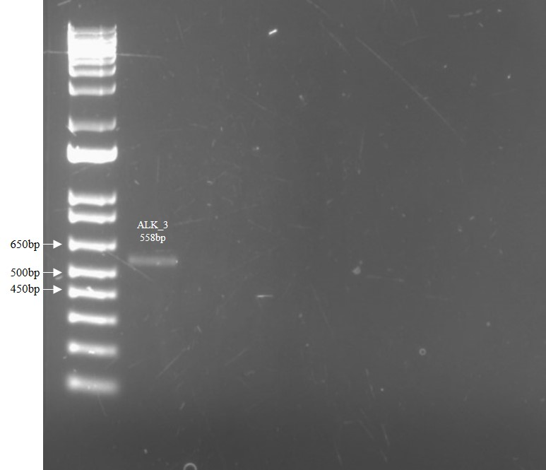

# Lab Book 22/8/19
- **Author:** Priyal Dass
- **Supervisor:** Associate Professor John Ashton
------------------------------------------------------------------
## Overview

PCR to amplify CR H3122 kinase domain + final (hopefully) selumetinib replicate

------------------------------------------------------------------
## Tasks

1. CR H3122 PCR and gel
2. Selumetinib SRB 9 day 1
------------------------------------------------------------------
## Task 1: CR H3122 PCR and gel

2 PCR reactions were set up according to the [Expand polymerase protocol](../Protocols/Expand_polymerase_PCR.md) with the [CR H3122 cDNA made yesterday](../Daily_lab_book/LB_19-08-21.md). Only the ALK_3 primers were used because they have all been confirmed to amplify the right region AND ALK_3 didn't give any extra bands last time.

- Reaction 1: ALK_3 Primers + CR H3122 cDNA
- Reaction 2: ALK_3 Primers + no DNA

The PCR products were run on a 1% agarose gel (made in TAE buffer and 2.5uL/100mL EtBr) for 45 minutes at 85V. The gel was then imaged:

PCR has worked but the band is a bit faint, consistent with previous gel - could probably be solved with a gradient PCR.

The PCR products were stored at 4C overnight

### Next
Gel purify product and send for sequencing.
------------------------------------------------------------------
## Task 2: Selumetinib SRB 9 day 1

A 96 well plate was set up using the P14 flask [split on 15/8/19](../Daily_lab_book/LB_19-08-15.md). The remaining cells were split 1:30 into a new flask.

### Next
Drug treat with selumetinib tomorrow.
