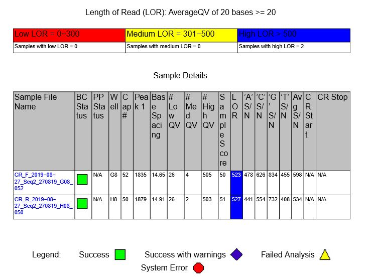
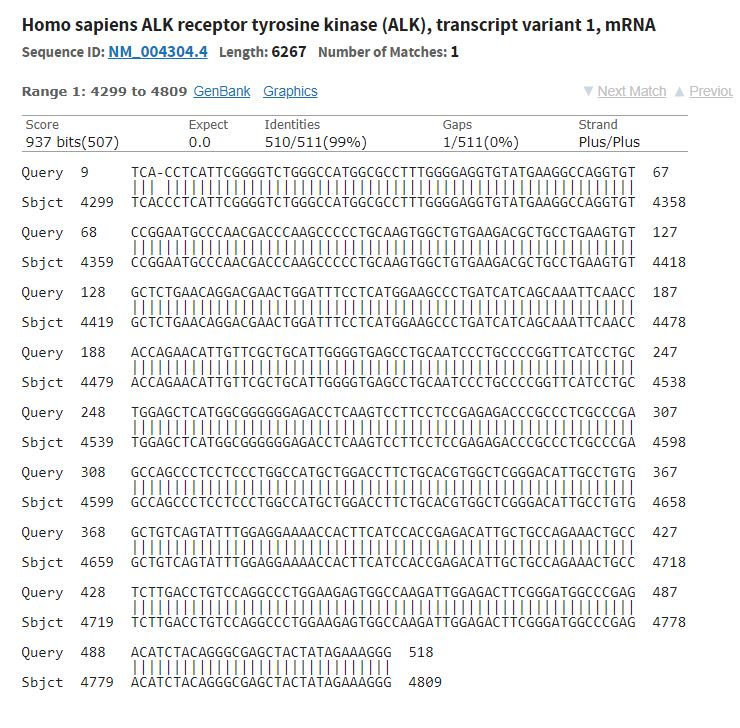

# Lab Book 27/8/19
- **Author:** Priyal Dass
- **Supervisor:** Associate Professor John Ashton
------------------------------------------------------------------

## Tasks

1. CR H3122 sequence analysis
------------------------------------------------------------------
## Task 1:  CR H3122 sequence analysis

The sequence quality is great:

But unfortunately there doesn't appear to be a mutation within the 550ish bp we looked at.

There is a 1bp deletion of a C in our sequence but the sequence quality is really poor at this point so it's most likely not a real mutation, but would be good to confirm.

### Next
Retry the sequencing of the CR H3122 ALK_3 product with the reverse primer. Also look for other potential targets.
