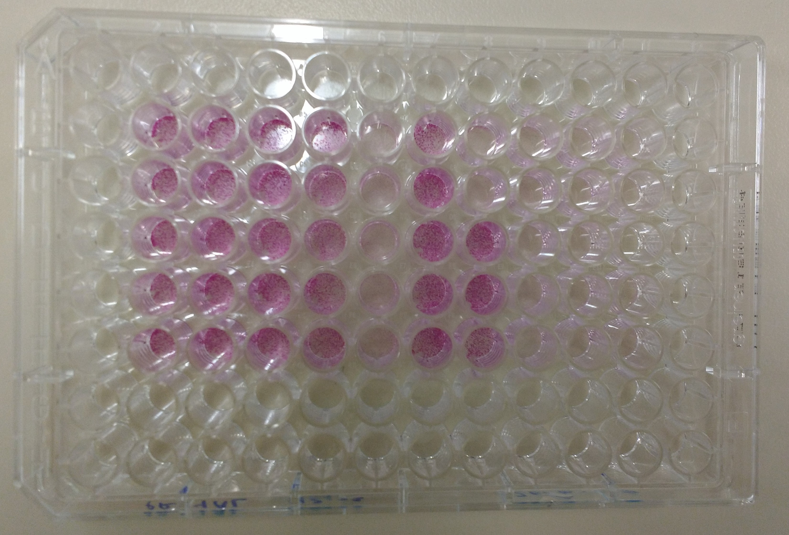
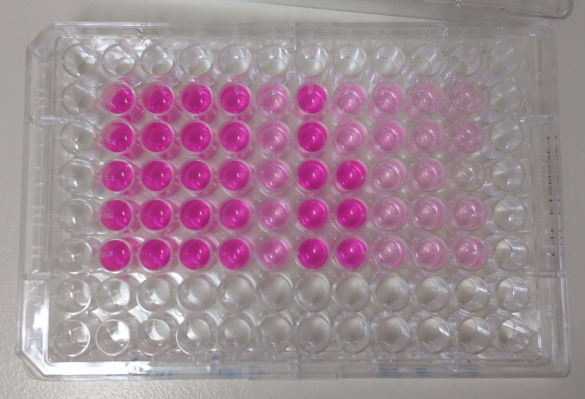

# Lab Book 24/6/19
- **Author:** Priyal Dass
- **Supervisor:** Associate Professor John Ashton
------------------------------------------------------------------
## Overview

Learning how to strain, read and analyse SRB results + cell maintenance

------------------------------------------------------------------
## Tasks

1. Strain drug treated cells and measure absorbance (and therefore drug effect) of cells treated on [Friday](../Daily_lab_book/LB_19-6-21.md) (Crizotinib assay 1)
2. Replacing cells [last changed on Friday](../Daily_lab_book/LB_19-6-21.md) with a new passage from Abby
------------------------------------------------------------------
## Task 1: Crizotinib cytotoxicity Assay 1 Day 5

[Protocol](../Protocols/SRB_Cytotoxicity_assay.md)

Cells were fixed and stained with SRB, stain was solubilised and absorbance was measured.
From looking at the plates it seems like there has been some pipetting error with the drug treatments. The staining of the wells (and therefore the cell viability) is expected to follow a gradient with more growth in the wells treated with low crizotinib concentrations and less growth in wells with higher concentrations. Most of the wells follow this pattern except in columns 7 and 8 where it looks like either a much lower concentration of drug was added or no drug was added at all, resulting in much higher cell viability than expected.

>96 well plate after SRB staining

This is more visible once the SRB was solubilised.

>96 well plate after solubilising SRB dye

However the remaining wells show the expected pattern and seeding was done properly.
The wells which have obviously not had the correct treatment were excluded from downstream analysis.

### Next
Data analysis using Excel and Graphpad Prism

------------------------------------------------------------------
## Task 2: Media change

The H3122 P5 cells which were split on [20/6/19](../Daily_lab_book/LB_19-6-20.md) and had their media changed on [21/6/19](../Daily_lab_book/LB_19-6-21.md) were checked under the microscope today. Cells appeared to be more spindle-like than normal - three days without fresh media was enough to induce a change in morphology. Definitely need to change media on alternate days to keep cell line healthy and consistent.
The flask was disposed of and replaced by Abby with H3122 P6 cells split 1:5 - they will need to be split in the next few days.

[Cell splitting protocol](../Protocols/Splitting_cells.md)

### Next
Change media or split cells on Wednesday 26/6/19 depending on growth
