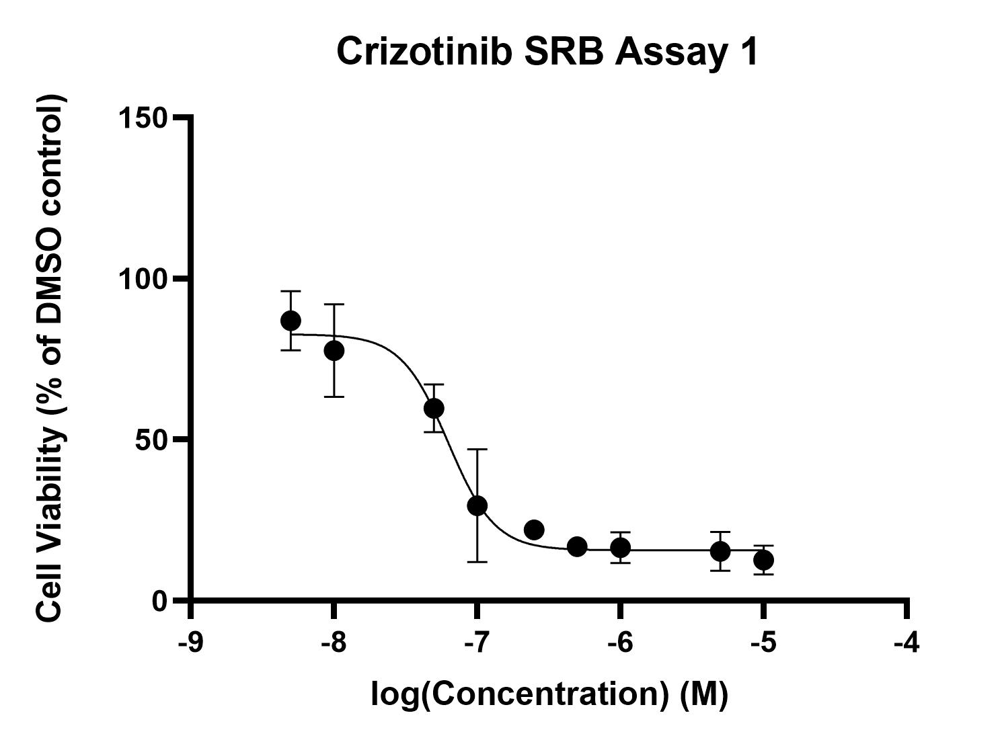

# Lab Book _ /_ /_
- **Author:** Priyal Dass
- **Supervisor:** Associate Professor John Ashton
------------------------------------------------------------------
## Overview
Wrapping up the analysis for crizotinib SRB assay 2 and continuing with assay 3
------------------------------------------------------------------
## Tasks
1. Finish Crizotinib assay 2 + data analysis
2. Crizotinib assay 3 Day 2
------------------------------------------------------------------
## Task 1: Finish Crizotinib assay 2 + data analysis

[Protocol](../Protocols/SRB_Cytotoxicity_assay.md) 
The protocol was paused yesterday after the acetic acid wash and dry step. Today the Tris-HCl was added and the absorbance was measured.
Data was analysed with Excel + Prism.

#### Results
Combined results for assay 1 and 2:
Crizotinib IC50=6.266e-008M

### Next
Continue with assay 3 and 4 to get a complete set of crizotinib only replicates

------------------------------------------------------------------
## Task 2: Crizotinib assay 3 Day 2

[Protocol](../Protocols/SRB_Cytotoxicity_assay.md) 
Day 2 of the SRB assay was carried out - 5 technical replicates for each crizotinib concentration.
Treated plate was incubated at 2pm

### Next
Continue with Day 5 protocol 2pm Friday 5/7/19
