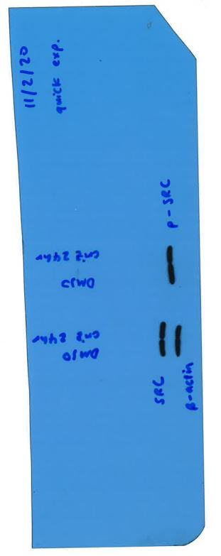

# Lab Book 11/2/20
- **Author:** Priyal Dass
- **Supervisor:** Associate Professor John Ashton
------------------------------------------------------------------
## Overview

Continuing combination SRBs, western drug treating and imaging 1st Western
------------------------------------------------------------------
## Tasks

1. CxS SRB 2 day 2
2. AxS SRB 2 day 2
3. H3/criz/24/2 day 2 (for western)
4. H3/ABT/48/1 day 2 (for western)
5. H3/criz/24/1 2* antibody and imaging

------------------------------------------------------------------
## Task 1: CxS SRB 2 day 2

The plates were treated with crizotinib, selumetinib and combination (according to Cr + Se new in drug combination spreadsheet)
### Next
Fix cells on Friday 14/2/20

------------------------------------------------------------------
## Task 2: AxS SRB 2 day 2

The plates were treated with crizotinib, selumetinib and combination (according to AB + Se in drug combination spreadsheet)

### Next
Fix cells on Friday 14/2/20

------------------------------------------------------------------
## Task 3: H3/criz/24/2 day 2 (for western)

One plate was treated with 1x IC50 of crizotinib and the other plate was treated with an equivalent volume of DMSO

### Next
Lyse tomorrow, store at 4C for a few hours and freeze at -20C for long term storage

------------------------------------------------------------------
## Task 4: H3/ABT/48/1 day 2 (for western)

One plate was treated with 1x IC50 of ABT-737 and the other plate was treated with an equivalent volume of DMSO
### Next
Lyse in 48 days, store at 4C for a few hours and freeze at -20C for long term storage

------------------------------------------------------------------
## Task 5: H3/criz/24/1 2* antibody and imaging

The blots were washed in TBST, incubated with 2* antibody (anti-rabbit for SRC and p-SRC and anti-mouse for b-actin) and washed in TBST again. The x-ray film was exposed for ~2 seconds (quick exposure) before developing.

**Results:**
>

Overall good signal from all antibodies after quick exposure, although no b-actin at all on right side (under p-SRC). Could have run off the gel or blot may have been cut so b-actin band was not actually exposed to the 1* antibody. Should use 10% gel next time bc proteins are quite small.
