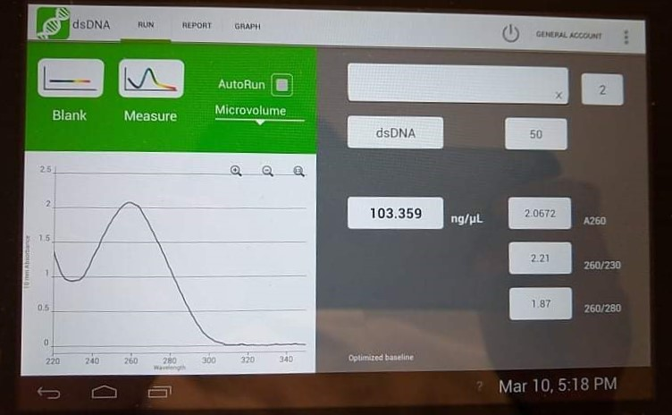

# Lab Book 10/3/20
- **Author:** Priyal Dass
- **Supervisor:** Associate Professor John Ashton
------------------------------------------------------------------
## Overview

Comparing ABT stocks and doing gDNA extraction for clonal H3122 cells.

------------------------------------------------------------------
## Tasks

1. Old vs new ABT SRB day 2
2. gDNA extraction for clonal H3122 cells

------------------------------------------------------------------
## Task 1:  Old vs new ABT SRB day 2

The plate was treated today with both ABT stocks at the using the same concentration range as previous ABT SRBs

### Next
TCA on 13/3/20

------------------------------------------------------------------
## Task 2: gDNA extraction for clonal H3122 cells

gDNA was extracted from 4 million cells. The lysis step was modified from 10 minutes to 1 hour at 55C.

Yield/quality was sufficient for WGS!

### Next
Do the same for CR-H3122 P4 cells
