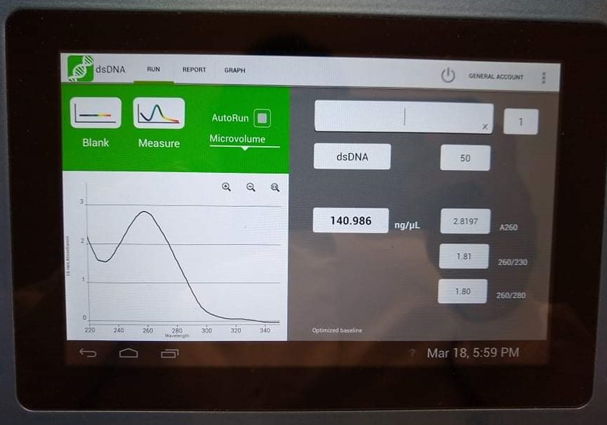

# Lab Book 18/3/20
- **Author:** Priyal Dass
- **Supervisor:** Associate Professor John Ashton
------------------------------------------------------------------
## Overview

Western samples and DNA extraction

------------------------------------------------------------------
## Tasks

1. Western samples - H3/criz/24 #2 and #3, CR/criz/24 #1 day 3
2. CR-H3122 gDNA extraction

------------------------------------------------------------------
## Task 1: Western samples - H3/criz/24 #2 and #3, CR/criz/24 #1 day 3

Cells were lysed and stored at -20C.

### Next
BCA assay and sample prep

------------------------------------------------------------------
## Task 2: CR-H3122 gDNA extraction

DNA was extracted from P4 H3122 cells for WGS, using the same method as the successful H3122 DNA extraction. DNA concentration was 140.986ng/uL and quality was good enough for WGS.

### Next
Dry down both samples for transport
