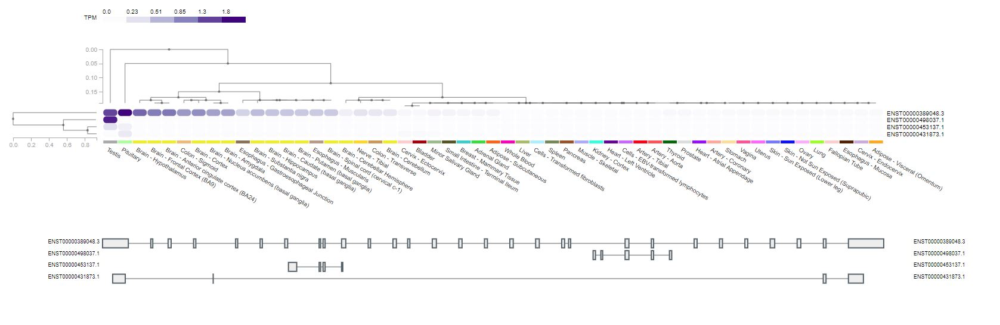
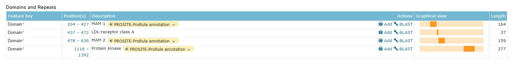
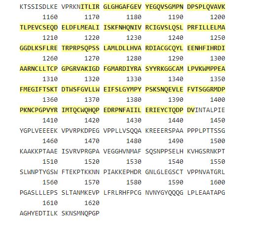
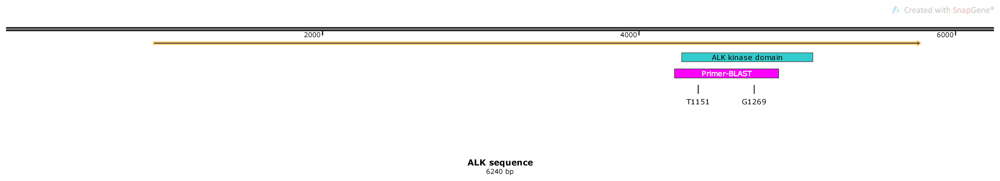

# H3122 and CR-H3122 kinase domain sequencing
## Aim: Amplify the ALK kinase domain from both H3122 and CR-H3122 and use Sanger sequencing to identify any crizotinib resistance mutations in CR-H3122.  

### Primer design

**Identifying the best ALK transcript**
Our experimental design involves converting mRNA to cDNA for all further analysis so it is important that we design our primers to match to the trancript that will be present in our cell lines.
Multiple ALK transcripts are available through Genbank but we need to identify the best candidate.  

**gTEX** was used to look at publically available expression data for each of the transcripts.

Of the four transcripts available only the top transcript (ENST00000389048.3) contained the kinase domain exons 22-25 (Lovisa et al., 2015) which makes it a clear choice for primer design. This transcript is also considered to be the canonical ALK transcript according to varsome.com. Also this the other three transcripts don't show a significant level of expression in any tissues whereas the expression of the top transcript is consistent with the literature.

**Uniprot** was used to identify the region of the ALK transcript corresponding to the kinase domain.

**UBSC** was used to visualise the transcript in the context of the human reference sequence (GRCh37/hg19). The Uniprot track was used to show the position of the protein kinase domain within the canonical transcript.

The canonical trancript and protein kinase region are highlighted in yellow.

Once the canonical transcript and the kinase domain had been identified, the transcript sequence was downloaded from NCBI (using ensembl.org to confirm the NCBI ID NM_004304.5) and opened in Snapgene. The kinase domain was manually annotated in blue and the positions of the 3' most and 5' most mutations listed by Rotow and Bivona (2017) were also annotated.

**Primer-BLAST** was used to generate candidate primer sequences. From the Snapgene file, the sequence between the two annotated positions as well as 150bp upstream and downstream (indicated in pink above) was put into Primer-BLAST.
The primer pairs generated by Primer-BLAST were manually curated by visualising their placement relative to the annotated mutation positions (Snapgene) and their potential to form self-dimers and heterodimers (IDT OligoAnalyser).
