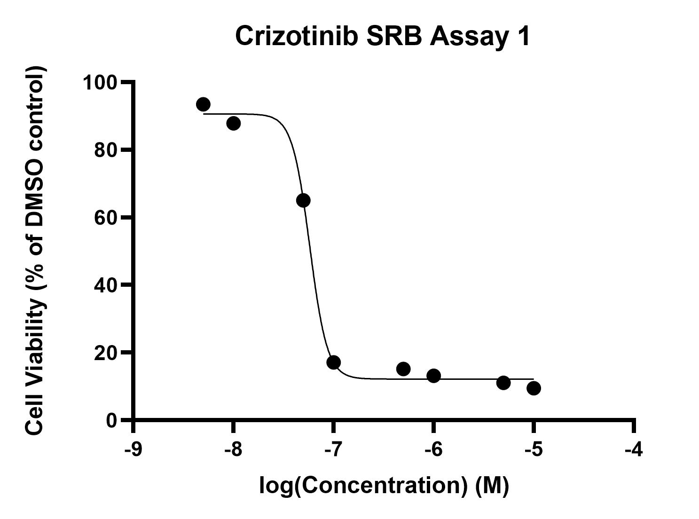

# Crizotinib cytotoxicity assays
## Aim: Learn SRB assay method and produce 3 or more consistent concentration/cell viability curves

>**[Raw data](../Raw_SRB_data/Crizotinib_only)**
### Cytotoxicity assay 1

* 20/6/19 [Day 1 - Seeding](../Daily_lab_book/LB_19-6-20.md)
* 21/6/19 [Day 2 - Drug treatment](../Daily_lab_book/LB_19-6-21.md)
* 24/6/19 [Day 5 - SRB stain](../Daily_lab_book/LB_19-6-24.md)
* 25/6/19 [Data analysis](../Daily_lab_book/LB_19-6-25.md)

#### Results
Crizotinib IC50 = 5.788e-008M (between 0.05 and 0.1uM)

### Cytotoxicity assay 2

* 27/6/19 [Day 1 - Seeding](../Daily_lab_book/LB_19-6-27.md)
* 28/6/19 [Day 2 - Drug treatment](../Daily_lab_book/LB_19-6-28.md)
* 1/7/19 [Day 5 - SRB stain](../Daily_lab_book/LB_19-7-01.md)
* 2/7/19 [Continuing day 5 protocol and data analysis](../Daily_lab_book/LB_19-7-02.md)
#### Results
Combining data from assay 1 and 2 
Crizotinib IC50 = 6.266e-008

