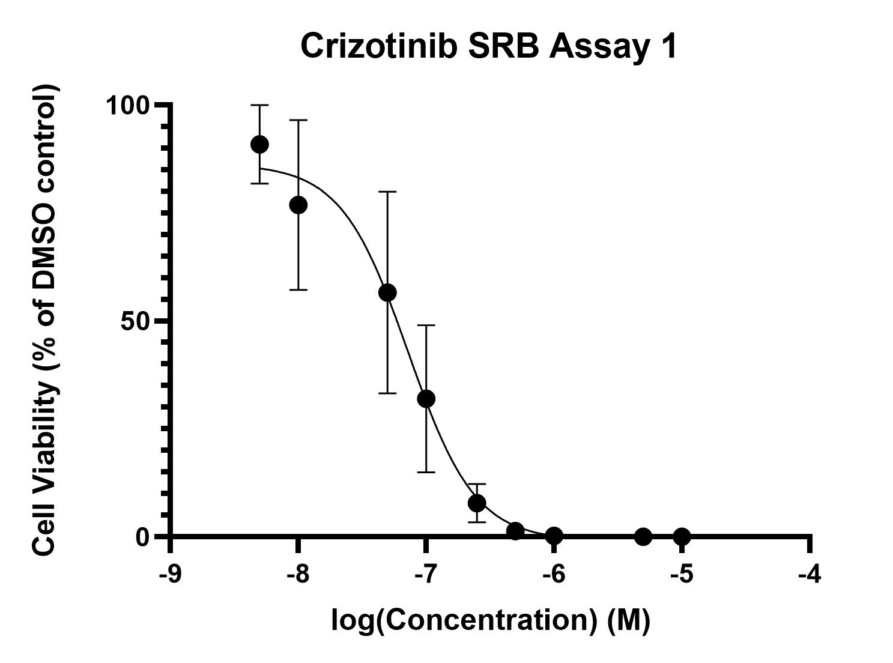

# Crizotinib cytotoxicity assays
## Aim: Learn SRB assay method and produce 3 or more consistent concentration/cell viability curves

>**[Raw data](../Raw_SRB_data/Crizotinib_only)**
### Cytotoxicity assay 1

* 20/6/19 [Day 1 - Seeding](../Daily_lab_book/LB_19-06-20.md)
* 21/6/19 [Day 2 - Drug treatment](../Daily_lab_book/LB_19-06-21.md)
* 24/6/19 [Day 5 - SRB stain](../Daily_lab_book/LB_19-06-24.md)
* 25/6/19 [Data analysis](../Daily_lab_book/LB_19-06-25.md)

### Cytotoxicity assay 2

* 27/6/19 [Day 1 - Seeding](../Daily_lab_book/LB_19-06-27.md)
* 28/6/19 [Day 2 - Drug treatment](../Daily_lab_book/LB_19-06-28.md)
* 1/7/19 [Day 5 - SRB stain](../Daily_lab_book/LB_19-07-01.md)
* 2/7/19 [Continuing day 5 protocol and data analysis](../Daily_lab_book/LB_19-07-02.md)

### Cytotoxicity assay 3

* 1/7/19 [Day 1 - Seeding](../Daily_lab_book/LB_19-07-01.md)
* 2/7/19 [Day 2 - Drug treatment](../Daily_lab_book/LB_19-07-02.md)
* 5/7/19 [Day 5 - SRB stain](../Daily_lab_book/LB_19-07-05.md)

### Cytotoxicity assay 4
(same plate as selumetinib assay 1)

* 4/7/19 [Day 1 - Seeding](../Daily_lab_book/LB_19-07-04.md)
* 5/7/19 [Day 2 - Drug treatment](../Daily_lab_book/LB_19-07-05.md)
* 8/7/19 [Day 5 - SRB stain](../Daily_lab_book/LB_19-07-08.md)
* 10/7/19 [Data analysis](../Daily_lab_book/LB_19-07-10.md)

> Crizotinib results (replicates 2, 3 and 4 corrected data) 
IC50 = 7.254e-008M

### ~~Cytotoxicity assay 5 (same plate as selumetinib assay 5)~~
Failed replicate - not included in prism file
* 18/7/19 [Day 1 - Seeding](../Daily_lab_book/LB_19-07-18.md)
* 19/7/19 [Day 2 - Drug treatment](../Daily_lab_book/LB_19-07-19.md)
* 22/7/19 [Day 5 - SRB stain](../Daily_lab_book/LB_19-07-22.md)
* 24/7/19 [Data analysis](../Daily_lab_book/LB_19-07-24.md)

### Cytotoxicity assay 6
(same plate as selumetinib assay 6)

* 25/7/19 [Day 1 - Seeding](../Daily_lab_book/LB_19-07-25.md)
* 26/7/19 [Day 2 - Drug treatment](../Daily_lab_book/LB_19-07-26.md)
* 29/7/19 [Day 5 - SRB stain](../Daily_lab_book/LB_19-07-29.md)
* 8/8/19 [Data analysis](../Daily_lab_book/LB_19-08-08.md)

## Final crizotinib results (replicates 2 - 6)

IC50 = 1.128e-007M

