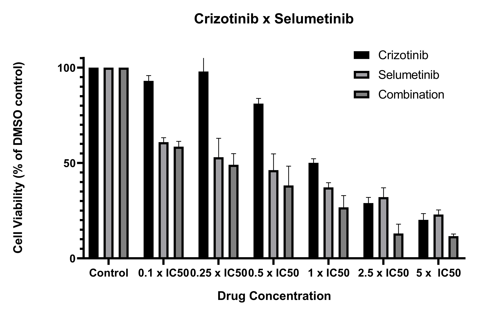

# Crizotinib x selumetinib cytotoxicity assays
## Aim: Produce 3 or more consistent concentration/cell viability curves with crizotinib/selumetinib

>**[Raw data](../Raw_SRB_data/O3_crizotinib_selumetinib)**

### Cytotoxicity assay 1

* 29/8/19 [Day 1 - Seeding](../Daily_lab_book/LB_19-08-29.md)
* 30/8/19 [Day 2 - Drug treatment](../Daily_lab_book/LB_19-08-30.md)
* 2/9/19 [Day 5 - SRB stain](../Daily_lab_book/LB_19-09-02.md)
* 3/9/19 [Data analysis](../Daily_lab_book/LB_19-09-03.md)

### Cytotoxicity assay 2

* 2/9/19 [Day 1 - Seeding](../Daily_lab_book/LB_19-09-02.md)
* 3/9/19 [Day 2 - Drug treatment](../Daily_lab_book/LB_19-09-03.md)
* 6/9/19 [Day 5 - SRB stain](../Daily_lab_book/LB_19-09-03.md)
* 9/9/19 [Data analysis](../Daily_lab_book/LB_19-09-09.md)

### Cytotoxicity assay 3

* 9/9/19 [Day 1 - Seeding](../Daily_lab_book/LB_19-09-09.md)
* 10/9/19 [Day 2 - Drug treatment](../Daily_lab_book/LB_19-09-10.md)
* 13/9/19 [Day 5 - SRB stain](../Daily_lab_book/LB_19-09-13.md)
* 16/9/19 [Data analysis](../Daily_lab_book/LB_19-09-16.md)

Final graph:

# New selumetinib IC50
### Cytotoxicity assay 1
* 3/2/20 [Day 1 - Seeding](../Daily_lab_book/LB_20-02-03.md)
* 4/2/20 [Day 2 - Drug treatment](../Daily_lab_book/LB_20-02-04.md)
* 5/2/20 [Day 5 - SRB stain](../Daily_lab_book/LB_20-02-05.md)
* 16/9/19 [Data analysis] (../Daily_lab_book/LB_19-09-16.md)

### Cytotoxicity assay 2
* 10/2/20 [Day 1 - Seeding](../Daily_lab_book/LB_20-02-10.md)
* 11/2/20 [Day 2 - Drug treatment](../Daily_lab_book/LB_20-02-11.md)
* 14/2/20 [Day 5 - SRB stain](../Daily_lab_book/LB_20-02-14.md)
* 16/9/19 [Data analysis] (../Daily_lab_book/LB_19-09-16.md)
