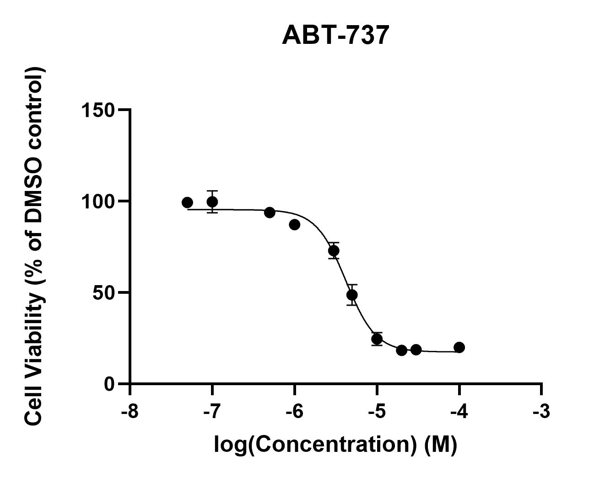
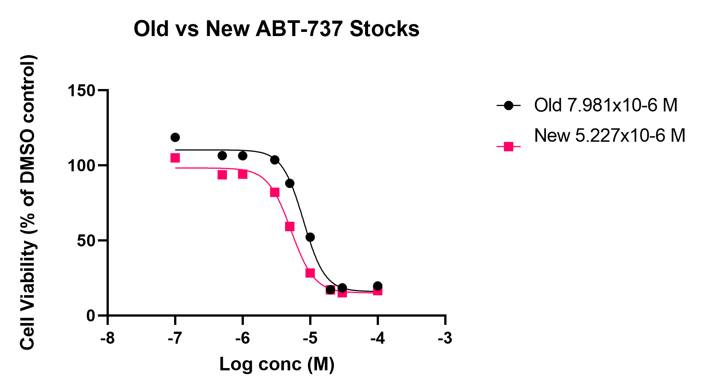

# ABT-737 cytotoxicity assays
## Aim: Produce 3 or more consistent concentration/cell viability curves with ABT-373

>**[Raw data](../Raw_SRB_data/O4_ABT)**

### Cytotoxicity assay 1 (same concentration range as selumetinib)

* 16/9/19 [Day 1 - Seeding](../Daily_lab_book/LB_19-09-16.md)
* 17/9/19 [Day 2 - Drug treatment](../Daily_lab_book/LB_19-09-17.md)
* 20/9/19 [Day 5 - SRB stain](../Daily_lab_book/LB_19-09-20.md)
* 23/9/19 [Data analysis](../Daily_lab_book/LB_19-09-23.md)

### Cytotoxicity assay 2 (adjusted concentration range #2 - #5)

* 19/9/19 [Day 1 - Seeding](../Daily_lab_book/LB_19-09-19.md)
* 20/8/19 [Day 2 - Drug treatment](../Daily_lab_book/LB_19-09-20.md)
* 23/9/19 [Day 5 - SRB stain](../Daily_lab_book/LB_19-09-23.md)
* 24/9/19 [Data analysis](../Daily_lab_book/LB_19-09-24.md)

### Cytotoxicity assay 3

* 23/9/19 [Day 1 - Seeding](../Daily_lab_book/LB_19-09-23.md)
* 24/8/19 [Day 2 - Drug treatment](../Daily_lab_book/LB_19-09-24.md)
* 27/9/19 [Day 5 - SRB stain](../Daily_lab_book/LB_19-09-27.md)
* 1/10/19 [Data analysis](../Daily_lab_book/LB_19-10-01.md)

### Cytotoxicity assay 4

* 30/9/19 [Day 1 - Seeding](../Daily_lab_book/LB_19-09-30.md)
* 1/10/19 [Day 2 - Drug treatment](../Daily_lab_book/LB_19-10-01.md)
* 4/10/19 [Day 5 - SRB stain](../Daily_lab_book/LB_19-10-04.md)
* 4/10/19 [Data analysis](../Daily_lab_book/LB_19-10-04.md)

### Cytotoxicity assay 5

* 30/9/19 [Day 1 - Seeding](../Daily_lab_book/LB_19-09-30.md)
* 1/10/19 [Day 2 - Drug treatment](../Daily_lab_book/LB_19-10-01.md)
* 4/10/19 [Day 5 - SRB stain](../Daily_lab_book/LB_19-10-04.md)
* 4/10/19 [Data analysis](../Daily_lab_book/LB_19-10-04.md)

>Final IC50: 4.209e-006M

Combination SRBs using ABT were showing a less potent effect for ABT. To test if the stocks had degraded over time, 1 SRB replicate was carried out comparing old and freshly made stocks.

### Cytotoxicity assay new vs old stock

