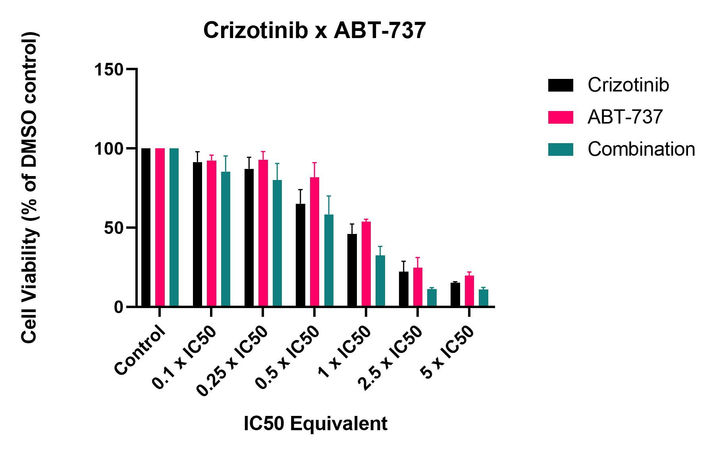

# Crizotinib x ABT-737 cytotoxicity assays
## Aim: Produce 3 or more consistent concentration/cell viability curves

>**[Raw data] (../Raw_SRB_data/Criz_ABT_combination)**

### Cytotoxicity assay 1

* 3/10/19 [Day 1 - Seeding](../Daily_lab_book/LB_19-10-03.md)
* 4/10/19 [Day 2 - Drug treatment](../Daily_lab_book/LB_19-10-04.md)
* 7/10/19 [Day 5 - SRB stain](../Daily_lab_book/LB_19-10-07.md)
* 9/10/19 [Data analysis](../Daily_lab_book/LB_19-10-09.md)

### Cytotoxicity assay 2

* 7/10/19 [Day 1 - Seeding](../Daily_lab_book/LB_19-10-07.md)
* 8/10/19 [Day 2 - Drug treatment](../Daily_lab_book/LB_19-10-08.md)
* 11/10/19 [Day 5 - SRB stain](../Daily_lab_book/LB_19-10-11.md)
* 16/10/19 [Data analysis](../Daily_lab_book/LB_19-10-16.md)

### Cytotoxicity assay 3

* 10/10/19 [Day 1 - Seeding](../Daily_lab_book/LB_19-10-10.md)
* 11/10/19 [Day 2 - Drug treatment](../Daily_lab_book/LB_19-10-11.md)
* 14/10/19 [Day 5 - SRB stain](../Daily_lab_book/LB_19-10-14.md)
* 16/10/19 [Data analysis](../Daily_lab_book/LB_19-10-16.md)

