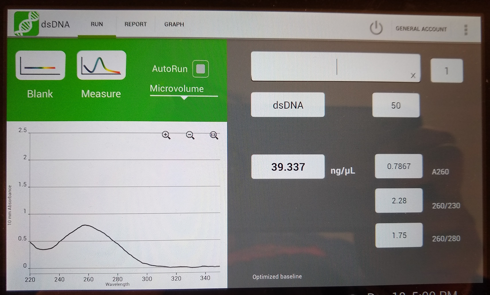

# H3122 and CR-H3122 whole genome sequencing
## Aim: Use WGS to sequence the H3122 and CR-H3122 cell lines to identify resistance mutations.  

#### Clonal amplification of H3122 and CR-H3122 cell lines

To reduce the genetic variability in the cell lines and therefore the gDNA samples, both cell lines were clonally purified. To do this the samples of both cells were sorted [using FACS](../Daily_lab_book/LB_19-10-25.md) to get one cell into each well into a 96-well plate.

One H3122 colony from the FACS plate was transferred to a 24-well plate, then to a 6-well plate and then a small flask. 3 vials of these cells have frozen in liquid nitrogen.

#### gDNA extraction
gDNA was extracted from the clonally purified H3122 cells, however the yield/quality was not good enough for WGS:

#### Preparation of gDNA for WGS
