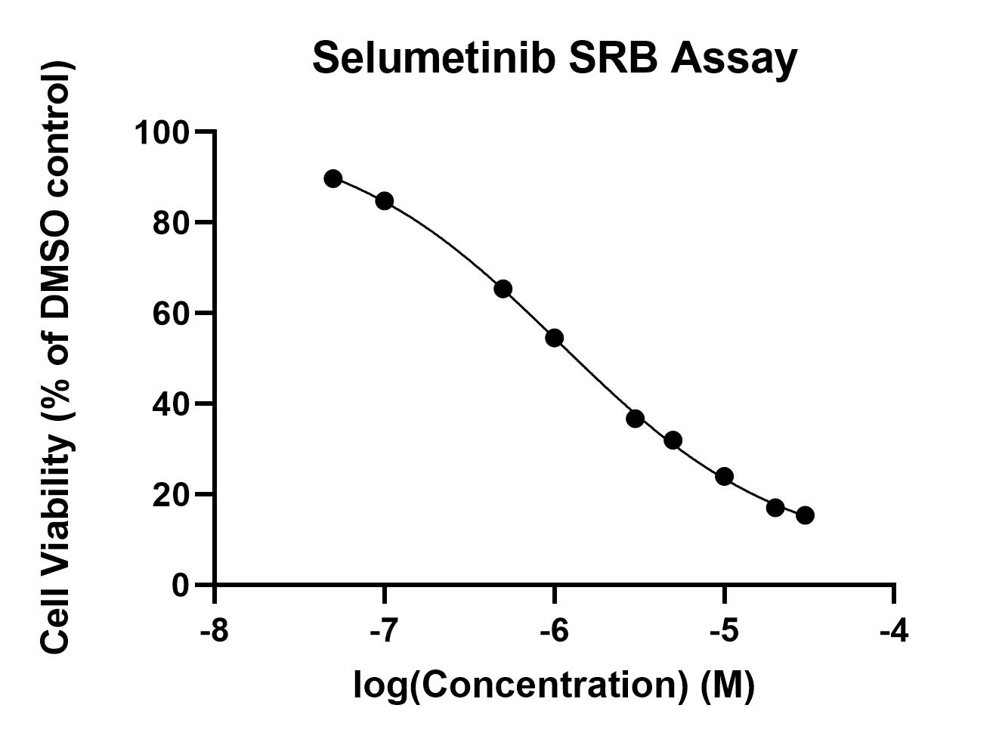

# Selumetinib cytotoxicity assays
## Aim: Produce 3 or more consistent concentration/cell viability curves with selumetinib

>**[Raw data](../Raw_SRB_data/Selumetinib_only)**
C:\Users\Priyal Dass\Documents\GitHub\PD_Lab_book\Raw_SRB_data\Selumetinib_only

### Cytotoxicity assay 1 (same plate as crizotinib assay 4)
>Raw data for this replicate is [here](../Raw_SRB_data/Crizotinib_only)

* 4/7/19 [Day 1 - Seeding](../Daily_lab_book/LB_19-07-04.md)
* 5/7/19 [Day 2 - Drug treatment](../Daily_lab_book/LB_19-07-05.md)
* 8/7/19 [Day 5 - SRB stain](../Daily_lab_book/LB_19-07-08.md)
* 10/7/19 [Data analysis](../Daily_lab_book/LB_19-07-10.md)

>Selumetinib results (replicate 1) 
IC50 = 1.083e-006M

### Cytotoxicity assay 2

* 8/7/19 [Day 1 - Seeding](../Daily_lab_book/LB_19-07-08.md)
* 9/7/19 [Day 2 - Drug treatment](../Daily_lab_book/LB_19-07-09.md)
* 12/7/19[Day 5 - SRB stain](../Daily_lab_book/LB_19-07-12.md)
* x/x/19 [Data analysis] (../Daily_lab_book/_)

### Cytotoxicity assay 3

* 8/7/19 [Day 1 - Seeding](../Daily_lab_book/LB_19-07-11.md)
* 9/7/19 [Day 2 - Drug treatment](../Daily_lab_book/LB_19-07-09.md)
* 12/7/19[Day 5 - SRB stain] (../Daily_lab_book/.md)
* x/x/19 [Data analysis] (../Daily_lab_book/.md)
