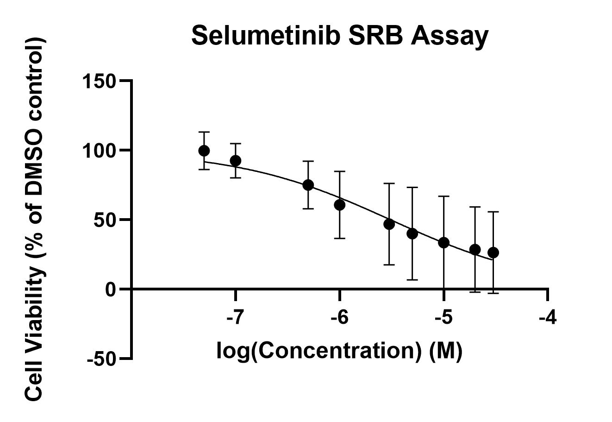

# Selumetinib cytotoxicity assays
## Aim: Produce 3 or more consistent concentration/cell viability curves with selumetinib

>**[Raw data](../Raw_SRB_data/Selumetinib_only)**

### Cytotoxicity assay 1 (same plate as crizotinib assay 4)

* 4/7/19 [Day 1 - Seeding](../Daily_lab_book/LB_19-07-04.md)
* 5/7/19 [Day 2 - Drug treatment](../Daily_lab_book/LB_19-07-05.md)
* 8/7/19 [Day 5 - SRB stain](../Daily_lab_book/LB_19-07-08.md)
* 10/7/19 [Data analysis](../Daily_lab_book/LB_19-07-10.md)

### Cytotoxicity assay 2

* 8/7/19 [Day 1 - Seeding](../Daily_lab_book/LB_19-07-08.md)
* 9/7/19 [Day 2 - Drug treatment](../Daily_lab_book/LB_19-07-09.md)
* 12/7/19 [Day 5 - SRB stain](../Daily_lab_book/LB_19-07-12.md)
* 15/7/19 [Data analysis](../Daily_lab_book/LB_19-07-15.md)

### Cytotoxicity assay 3

* 11/7/19 [Day 1 - Seeding](../Daily_lab_book/LB_19-07-11.md)
* 12/7/19 [Day 2 - Drug treatment](../Daily_lab_book/LB_19-07-09.md)
* 15/7/19 [Day 5 - SRB stain](../Daily_lab_book/LB_19-07-15.md)
* 16/7/19 [Data analysis](../Daily_lab_book/LB_19-07-16.md)

>Selumetinib results (replicate 1, 2 and 3 corrected data) 
Data was constrained (top = 100%, bottom = 0%)
IC50 = 1.850e-006M

### Cytotoxicity assay 4

* 15/7/19 [Day 1 - Seeding](../Daily_lab_book/LB_19-07-15.md)
* 16/7/19 [Day 2 - Drug treatment](../Daily_lab_book/LB_19-07-16.md)
* 19/7/19 [Day 5 - SRB stain](../Daily_lab_book/LB_19-07-19.md)
* 24/7/19 [Data analysis](../Daily_lab_book/LB_19-07-24.md)

### ~~Cytotoxicity assay 5 (same plate as crizotinib assay 5)~~
Failed replicate - not included in prism file
* 18/7/19 [Day 1 - Seeding](../Daily_lab_book/LB_19-07-18.md)
* 19/7/19 [Day 2 - Drug treatment](../Daily_lab_book/LB_19-07-19.md)
* 22/7/19 [Day 5 - SRB stain](../Daily_lab_book/LB_19-07-22.md)
* 24/7/19 [Data analysis](../Daily_lab_book/LB_19-07-24.md)

Updated graph with replicates 1-4 (but will likely exclude 1 and 2 in final graph):  
IC50 = 3.096e-006M

### Cytotoxicity assay 6
(same plate as crizotinib assay 6)

* 25/7/19 [Day 1 - Seeding](../Daily_lab_book/LB_19-07-25.md)
* 26/7/19 [Day 2 - Drug treatment](../Daily_lab_book/LB_19-07-26.md)
* 29/7/19 [Day 5 - SRB stain](../Daily_lab_book/LB_19-07-29.md)
* 8/8/19 [Data analysis](../Daily_lab_book/LB_19-08-08.md)

### Cytotoxicity assay 7

* 8/8/19 [Day 1 - Seeding](../Daily_lab_book/LB_19-08-08.md)
* 9/8/19 [Day 2 - Drug treatment](../Daily_lab_book/LB_19-08-09.md)
* 12/8/19 [Day 5 - SRB stain] (../Daily_lab_book/LB_19-07-29.md)
* 8/8/19 [Data analysis] (../Daily_lab_book/LB_19-08-08.md)
