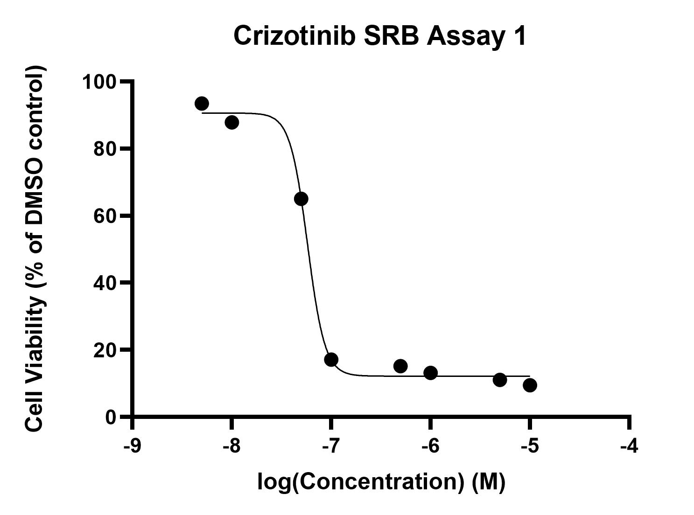

# Crizotinib cytotoxicity assays
## Aim: Learn SRB assay method and produce 3 or more consistent concentration/cell viability curves
### Cytotoxicity assay 1

* 20/6/19 [Day 1 - Seeding](../Daily_lab_book/LB_19-6-20.md)
* 21/6/19 [Day 2 - Drug treatment](../Daily_lab_book/LB_19-6-21.md)
* 24/6/19 [Day 5 - SRB stain and analysis](../Daily_lab_book/LB_19-6-24.md)
* 25/6/19 [Data analysis](../Daily_lab_book/LB_19-6-25.md)

#### Results
Crizotinib IC50 = 5.788e-008M

