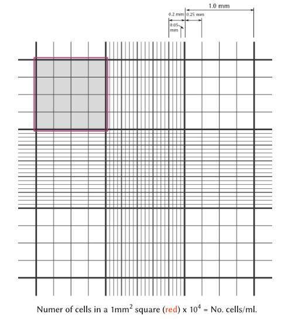

# Cytotoxicity assay protocol
- **Paper:**
- **Authors:**
- **Date:**

------------------------------------------------------------------
## Overview

In order to measure the cytotoxic activity of a compound (or several compunds) the H3122 cells are seeded in 96-well plates at a known density and allowed to adhere. They are then  treated with a gradient of concentrations of the compound of interest. After drug treatment period, the cells are fixed and stained with SRB to dye to protein content. The dye is solubilised and the absorbance of each well is read to measure the effects of the treatment.

------------------------------------------------------------------
## Materials

### RPMI1640 media (Thermofisher) for ELM4-ALK H3122 cells

| Additive |  Final Concentration   |
| :------  | :-------- |
| FBS | 5% |
| Penicillin/Streptomycin  | 1% |

Store at 4°C.

Warm to 37°C before use.

### RPMI1640 media (Thermofisher) with no supplements

Store at 4°C.

Warm to 37°C before use.

### Sulphorhodamine B (SRB)

| Additive | Final concentration |
|------------|-------|
|SRB   |  0.4% |
|Acetic acid   |1%   |

### 10% Tricholoroacetic acetic acid (TCA)

### 40mM Crizotinib stock (in DMSO)

### 1% acetic acid

### TRIS/HCl buffer
Adjust pH to 10.5 BioRad Microplate Spectrophotometer

###### Other equipment
- 96 well plates
- Haemocytometer and coverslip
- Serological pipette
- 20uL and 200uL pipettes
- Repeat pipette
- Eppendorf tubes
- Aspirator
- Gel drier

BioRad Microplate Spectrophotometer

------------------------------------------------------------------
## Methods

### Day 1

#### Cell seeding

Remove cells from the flask according to [Steps 1-9 of the cell splitting protocol](../Protocols/Splitting_cells.md) - resulting in 10mL of cells resuspended in fresh media

###### Cell counting
1. Clean haemocytomer and coverslips with ethanol and place coverslip on top
2. Pipette 20uL of resuspended cells into onto the haemocytomer, under the coverslip
3. Using a microscope, count the numbers of cells in 3 of the 9 larger squares (1 square highlighted in red below)

4. Take the average cell count of the three squares and multiply by 10,000 to get cells per mL
5. Calculate the desired number of cells for all wells (including extra to account for pipetting error) and the total volume of media required for all wells (including extra)
6. Divide the desired number of cells by the total cells per ml to get the volume of cells needed to get desired dilution
7. Subtract that number from the total media volume required to get the volume of media needed for the dilution

**Example:**

>3 cell counts: **115,110, 180**
>
>Average cell count = **135**
>**135 x 10,000 = 1,350,000 cells per mL** in the resuspended cells
>
>To get 7000 cells/well in a 96 well plate: round up to 110 and multiply
>**7000 x 110 = 770,000 cells** in 110 wells
>
>Total media volume for 110 wells **150uL x 110 = 16.5mL**
>
>Volume of cells required in 16.5mL **770,000/1,350,000 = 0.5704mL**
>
>**16.5mL - 0.5704mL = 15.93mL** of fresh media
>
>Final dilution = **15.93mL fresh media + 0.57mL resuspended cells**

8. Pipette 150uL of the diluted cells each well in a 96 well plate. Gently tap the place 10 times on each side to bring the cells towards the centre of each well.
9. Place lid on plate and incubate plate for 24hrs to allow cells to adhere

### Day 2

#### Setting up crizotinib treatments

1. Using the 40mM crizotinib stock, make four 1:10 serial dilutions of crizotinib in DMSO to get four aliquots with concentrations of 4mM, 0.4mM. 0.04mM and 0.004mM crizotinib.
2. Use the serial dilutions to make the 10 crizotinib dilutions to be added to plate by following the table below. Make up the 10 crizotinib dilutions to 100uL using serum free RPMI1640 media, pipetting up and down to mix solution

  | Final conc uM | 11x Conc uM | 4mM | 0.4mM | 0.04mM | 0.004mM | DMSO |
| ------------- |:-------------:|:-------------:|:-------------:|:-------------:|:-------------:| -----:|
|0   |  0 |  - | -  | -  | -  |  2.75 |
|0.005   | 0.055  |  - |  - | -  | 1.375  | 1.375  |
|0.01   | 0.11  | -  |-   |  - | 2.75  |  0 |
|0.05   | 0.55  |  - | -  |1.375   |-   |1.375   |
|0.1   |  1.1 |  - | -  | 2.75  | -  |0   |
|0.25   | 2.75  |  - |  0.69 | -  | -  |  2.06 |
|0.5   |  5.5 | -  |   1.375| -  | -  | 1.375  |
|1   | 11  | -  |  2.75 | -  |  - | 0  |
|5   |  55 | 1.375  | -  | -  |  - |   1.375|
|10   | 110  | 2.75  | -  |  - | -  |  0 |

4. Pipette 15uL of each crizotinib dilution into the wells seeded yesterday. One column per concentration and technical replicates for each concentration are in B/C/D for each column.  

 
Pink = increasing concentration of treatments,
blue = technical replicates for each concentration  

5. Gently tap the plate 10 times on each side and incubate at 37°C for 72 hours.

### Day 5

#### Staining

-  (Wellcome)
1. Use aspirator to remove media from each well
2. Add 150uL of 10% TCA to each well and incubate in fridge (or on ice) to fix cells for at least 30 minutes
-  (Adams)
3. Remove the TCA from the plate and rinse 2x with dH20 to remove all remaining TCA (should still be able to see the cells at the bottom of the well at this point)
4. Dry the plate by either: inverting the plate onto a paper towel at room temperature, or standing plate upright in gel drier for 20 minutes
5. Add 100uL of 0.4% SRB in 1% acetic acid to each treated well and incubate for 10 minutes at room temperature
6. Use aspirator to remove SRB from each well
7. Wash the plate by submerging the it in a container of acetic acid so every well is filled then emptying it. Do this three times and then once more with fresh acetic acid. Pour the acetic acid remaining in the container over the wells and empty it out
8. Add 100uL of 10mM Tris/HCl  and incubate for 10 minutes to solubilise the dye

#### Plate reader

1. Open 'Microplate manager' -> File -> New Endpoint Protocol -> Enter wavelength 510nm -> Mix plate at 'medium' setting
2. 'Run' to take reading, discard the first reading and click 'run' again (taking the second reading to allow the wells to be mixed as well as possible)
3. Copy output into .xlsx and save in personal user folder
4. Use USB to transfer to own computer - attached computer doesn't have internet access

#### Data analysis
##### Excel
1. Open .xlsx with raw absorbance readings
2. Highlight the well which had drug treated cells
3. Remove any obvious outliers due to experimental error
4. Find the mean reading for each column
5. Transpose the mean readings vertically
6. Calculate each mean as a percentage of the DMSO control

#####  GraphPad Prism
1. If making a new project:
>New table & graph -> XY -> Options -> 3 replicates
2. In X paste molar crizotinib concentrations
3. In appropriate Y column paste mean absorbances as % of DMSO
4. To log crizotinib concentrations
>Analyse -> Transform -> Transform X values using -> X=log(X)
5. Analyse and graph transformed data
>Analyse -> XY analyses -> Non-linear regression -> Dose-response - Inhibition -> log(inhibitor) vs response -- Variable slope (four parameters)

--------------------------------------------------------
### Notes
1. When using aspirator remove from wall before turning off the handle (opposite of sign)
2. When washing with acetic acid in Step 6 make sure the whole well is covered to remove excess dye - plate reader will pick it up
3. After fixing the cells, the experiment can be paused anytime after a drying step. If doing this store plates at room temperature with the lid on
