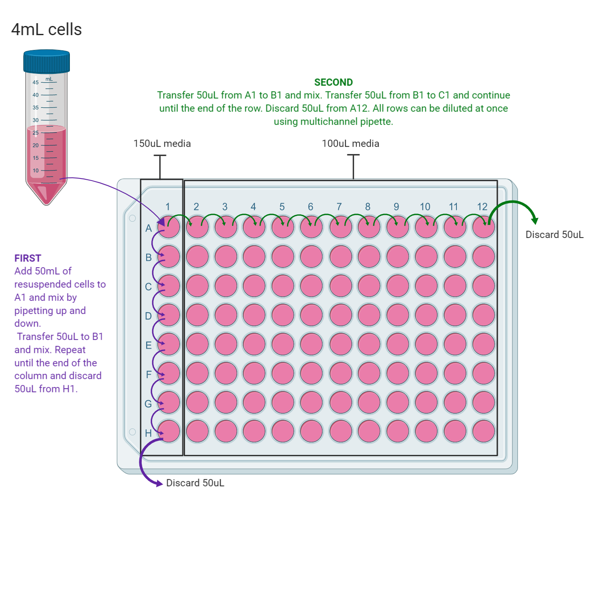

# Protocol
Via Gabs

------------------------------------------------------------------
## Overview

This protocols is for isolating pure colonies of cells derived from a single cell for downstream applications

------------------------------------------------------------------
## Materials

- RPMI1640 media (supplements appropriate for each cell line)
- 96 well plate

------------------------------------------------------------------
## Methods

#### Cells

Split a 70-80% confluent medium flask according to [Steps 1-8 of the cell splitting protocol](../Protocols/Splitting_cells.md) but instead resuspend the pelleted cells in 4mL of media instead of 10mL.

In a 96 well plate pipette media (volumes in figure) and dilute the cells as shown below:

First serially dilute the cells down column 1 top to bottom and then serially dilute column 1 from left to right.

Incubate the plate and check daily for single cell colonies. Mark these wells on the lid and grow cells in the 96 well plate unti the well is 70-80% confluent.

Transfer single cell colonies to a 24 well plate (using same procedure as for splitting flasks but scaled down) and then to a flask for maintenance.
